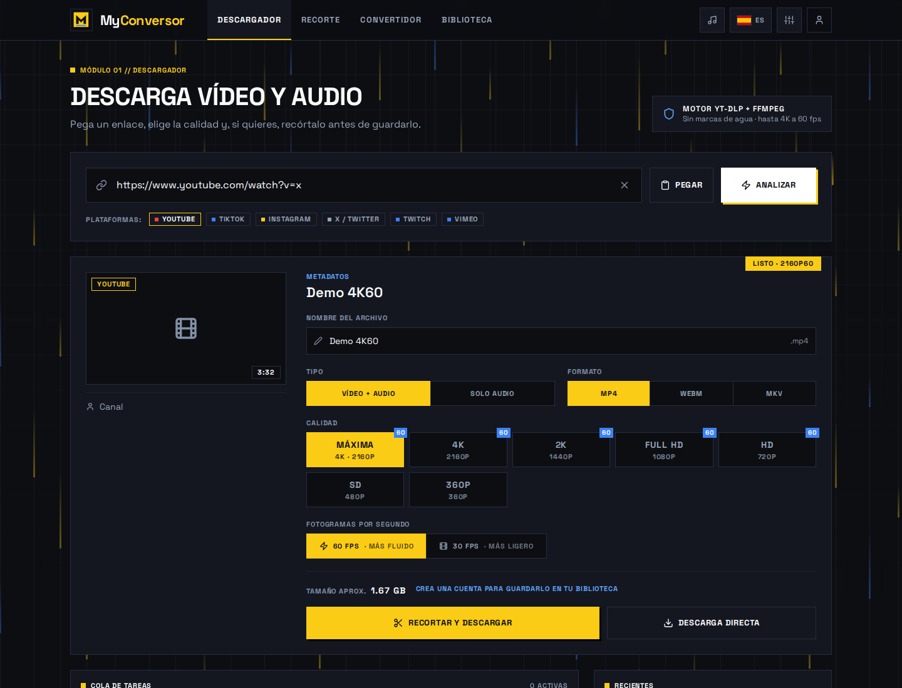
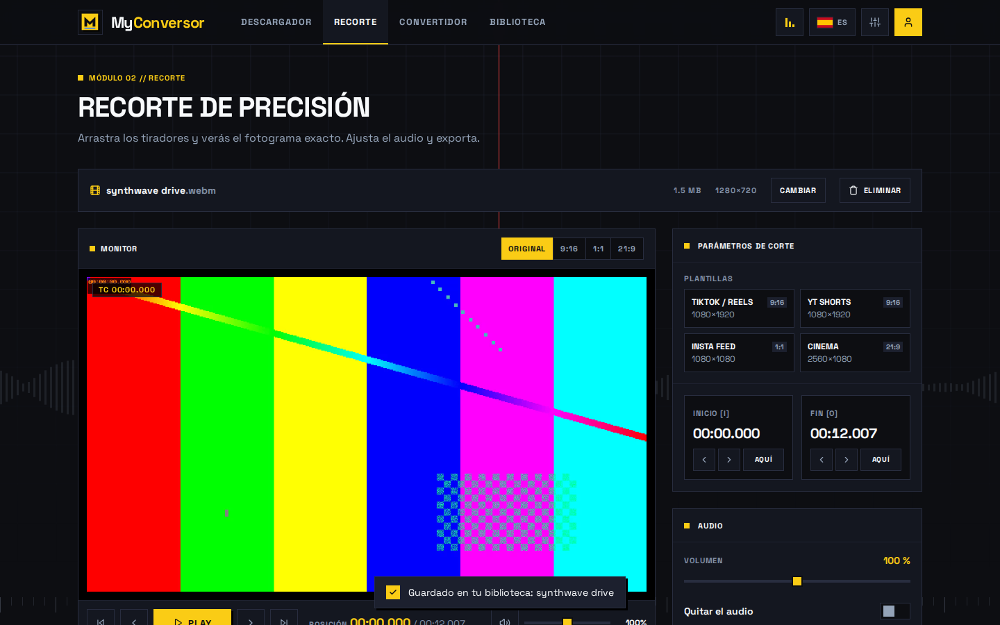
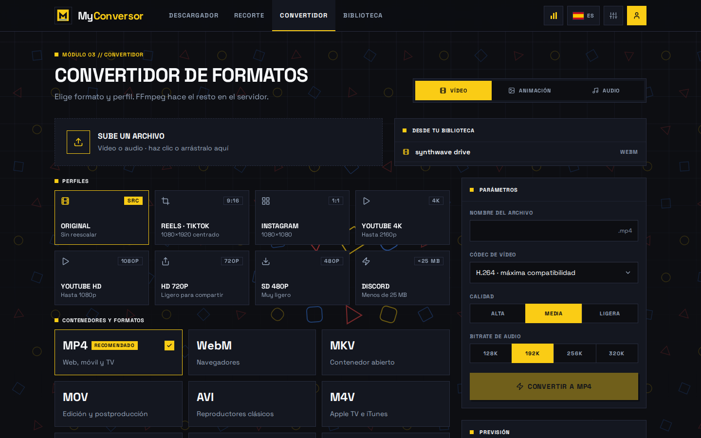
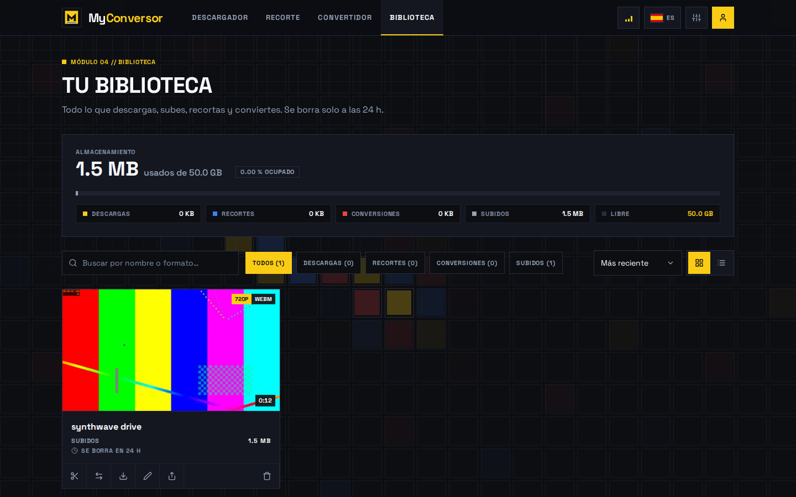
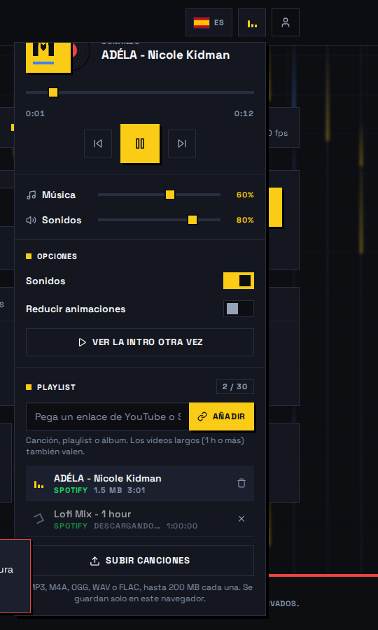
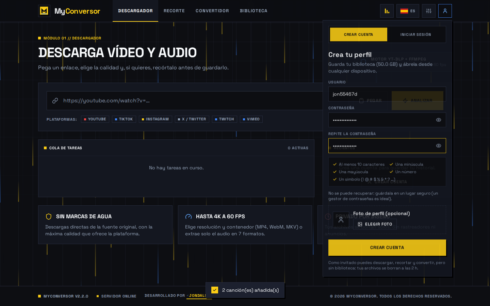

<p align="center">
  
</p>

<h1 align="center">MyConversor</h1>

<p align="center">
  🎬 Descarga, ✂️ recorta y 🔄 convierte vídeo y audio con <b>yt-dlp</b> y <b>FFmpeg</b>.<br>
  Una sola página, estilo «Bauhaus Dark Studio», en español e inglés y con 💯 en Google Lighthouse.
</p>

<p align="center">
  Desarrollado por <a href="https://github.com/Jondals">jondals</a> · v3.0.0
</p>

---

## 🚀 Arrancar en 1 minuto

Requisitos: **Node 22.22+ / 24.15+** (Angular 22 lo exige) y **pnpm 12** (viene con Node: `corepack enable`; la versión exacta vive en `package.json` → `devEngines`, y pnpm la descarga sola si hace falta).

```bash
pnpm install
pnpm start         # → http://localhost:4200
```

`pnpm start` arranca **a la vez** la web (Angular) y el servidor (API + FFmpeg + yt-dlp). No hace falta Python ni instalar nada más. La primera vez, el servidor descarga FFmpeg y yt-dlp por su cuenta en `.bin/` (unos 120 MB).

| Comando | Qué hace |
| --- | --- |
| `pnpm start` | 🛠️ Desarrollo: web + API, con recarga al guardar |
| `pnpm build` | 📦 Compila y prerenderiza la web en `dist/` |
| `pnpm serve` | 🌐 Producción: un solo proceso en `http://localhost:8000` (web + API) |
| `pnpm test` | 🧪 El test completo (ver abajo) |
| `pnpm check` | ✅ Compila en una carpeta temporal, pasa el test contra esa compilación y comprueba que no queda rastro |

## 🖼️ Pantallas

| ⬇️ Descargar | ✂️ Recortar |
| --- | --- |
|  |  |

| 🔄 Convertir | 📚 Biblioteca |
| --- | --- |
|  |  |

| ⚙️ Opciones y música | 👤 Cuenta |
| --- | --- |
|  |  |

## ✨ Qué hace

Todo es **una sola página**: las secciones se muestran u ocultan sin recargar, y el trabajo de cada una se conserva al cambiar de sección.

### ⬇️ Descargar
- Arriba a la derecha ves el **estado real del servidor**: *En línea · 24 ms* o *Sin conexión*.
  - Se comprueba cada 30 s, al volver a la pestaña y al recuperar la red.
  - Solo sale «en línea» si el servidor responde **y** tiene FFmpeg y yt-dlp instalados.
  - Púlsalo para comprobarlo al momento.
- Pega un enlace de **YouTube, TikTok, Instagram, X/Twitter, Twitch o Vimeo**.
  - El botón **Pegar** lo mete directamente en el campo.
  - `Ctrl+V` en cualquier parte de la página también funciona.
- Verás título, autor, miniatura y **las calidades reales**: *Máxima*, 4K, 2K (1440p), 1080p, 720p… hasta 144p. El tope es **4K a 60 fps**.
  - Las calidades que existen a 60 fps llevan una insignia **60**.
  - A partir de **720p**, si el vídeo lo admite, eliges **60 fps** (más fluido) o **30 fps** (más ligero): 4K60, 2K60, 1080p60 y 720p60.
- Contenedor **MP4, WebM o MKV**, o solo el audio en **MP3 (320/192/128), M4A, Opus, Vorbis, FLAC, WAV o ALAC**.
- El nombre del archivo es **el título que tiene en su plataforma**, y lo puedes cambiar.
- **Recortar y descargar** te lleva al editor; **Descarga directa** lo baja tal cual.
- En «Recientes» cada archivo tiene su botón para eliminarlo.
- 🟣 Los **clips de Twitch** se detectan como vídeo, aunque la plataforma no indique el códec.

### ✂️ Recortar
- Línea de tiempo con miniaturas reales. **Al arrastrar un tirador ves ese fotograma en vivo**, y el cabezal no puede salir del tramo.
- ⚡ Carga rápida: el código del recortador se descarga en segundo plano antes de que lo abras.
  - Las miniaturas de los archivos guardados las genera FFmpeg de una vez en el servidor: una sola imagen, unos 0,1 s, también con vídeos de 1 h.
  - Así no compiten con la vista previa por la conexión.
- Plantillas: **TikTok/Reels, YouTube Shorts (9:16), Instagram (1:1) y cine (21:9)**.
- Audio: volumen del 0 al 200 %, o quitarlo.
- Cursores propios: un cabezal rojo sobre la línea de tiempo y unas flechas ↔ sobre los tiradores, que se mantienen mientras arrastras.
- Botón **Eliminar** para borrar el vídeo cargado.
- Atajos de teclado:
  - `Espacio`: reproducir o pausar.
  - `I` / `O`: marcar el inicio y el fin.
  - `←` `→`: mover el cabezal; con `Shift`, de segundo en segundo.
  - `[` `]` y `M`.

### 🔄 Convertir
Convertidor **universal**: según lo que subas (o elijas de tu biblioteca), solo se muestran las pestañas y formatos de salida a los que ese archivo puede convertirse — nunca una conversión imposible. La disposición no cambia de un grupo a otro, así que cambiar de pestaña no hace saltar la página.
- 🎞️ **Vídeo**: MP4 (H.264/H.265), WebM (VP9/AV1), MKV (H.264/H.265/AV1/VP9), MOV (ProRes/H.264), AVI, M4V, FLV, MPEG y OGV.
- 🖼️ **Animación**: GIF, WebP animado y APNG.
- 🎵 **Audio**: con pérdida (MP3, AAC, OGG, Opus, WMA, AC3) y sin pérdida (WAV, FLAC, ALAC, AIFF).
- 🖼️ **Imagen**: PNG, JPG, WebP, AVIF, BMP, TIFF, ICO y GIF (fijo). También saca un fotograma de cualquier vídeo o GIF como imagen.
- 📄 **Documento** (necesita LibreOffice en el servidor, ver Configuración): PDF, DOCX, ODT, RTF, TXT, HTML, EPUB, XLSX, ODS, CSV, PPTX y ODP. Incluye PDF ⇄ Word/PowerPoint/Excel, exportar una página de un PDF o de un documento como imagen, etc.
- Perfiles de vídeo e imagen: Original, Reels/TikTok (9:16), Instagram (1:1), YouTube 4K, YouTube HD, HD 720p, SD 480p y Discord (< 25 MB).
- Códec de vídeo, calidad (alta/media/ligera), bitrate de audio y fotogramas por segundo (animación) — cada ajuste se desactiva solo cuando no aplica a la salida elegida, en vez de desaparecer.
- Una **previsión** arriba del todo con el peso y el tiempo estimados, antes de convertir.
- Botón **Eliminar** para borrar el archivo cargado.

### 📚 Biblioteca
- También para **invitados** (10 GB, se borra a las 2 h): el almacenamiento y el aviso de cuenta comparten una sola franja compacta, sin el scroll de antes.
- Espacio usado y libre, con una barra por tipo: descargas, recortes, conversiones y subidos.
- Las imágenes muestran su miniatura y los documentos un icono con su extensión; al reproducir, una imagen o un documento se abren en una pestaña nueva en vez del reproductor.
- Búsqueda, filtros y orden (reciente, antiguo, tamaño, nombre), en **vista de cuadrícula o de lista**.
- Cuenta atrás de borrado en cada archivo.
- En cada archivo: reproducir, recortar, convertir, descargar, renombrar, compartir el enlace y eliminar.
- 🗑️ **Se puede eliminar desde cualquier sección** y desaparece al momento de todas partes: del disco del servidor, de la biblioteca, del recortador, del convertidor y de «Recientes».

### 🧭 Cabecera
Solo lo justo: logo, secciones y tres botones (idioma, opciones y cuenta).
- ⚙️ **Opciones**: arriba el **reproductor de música**, en medio los ajustes y abajo la **playlist**.
  - 🎵 **Reproductor**:
    - Un vinilo en su funda amarilla (como el logo) que sale y gira mientras suena, y el icono de Opciones se convierte en un ecualizador.
    - Anterior, reproducir/pausar, siguiente y barra de progreso.
    - Volumen de la **música** y de los **sonidos** por separado.
  - ⚙️ **Ajustes**: sonidos sí/no (con su propio volumen aquí mismo), reducir animaciones y volver a ver la intro.
  - 📃 **Playlist** (hasta **30 canciones**), con el reproductor (vinilo, progreso y volumen de música) arriba del todo del bloque:
    - **Pega un enlace de YouTube o Spotify**: una canción, una playlist o un álbum. Las canciones aparecen al momento como *Descargando…* y se bajan una a una.
    - Los vídeos largos (**1 h o más**, hasta 4 h) también valen.
    - Spotify no deja descargar su audio, así que se leen el título y el artista de su página pública y la canción se busca en YouTube; si un resultado falla, se prueba el siguiente.
    - También puedes **subir archivos** (MP3, M4A, OGG, WAV o FLAC, hasta 200 MB cada uno).
    - Todo se guarda **solo en tu navegador** (IndexedDB); el servidor no se queda nada. La música sigue sonando al cerrar el menú.
    - Si YouTube pide verificar que no eres un bot (pasa con servidores en la nube), mira **Despliegue**.
- 🇪🇸/🇬🇧 **Idioma**: un botón con la bandera cambia toda la web entre español e inglés. Recuerda tu elección y la primera vez usa el idioma del navegador.
- 👤 **Cuenta**: un desplegable justo debajo de tu icono.
  - Arriba una ficha con la franja Bauhaus, tu foto (clic para cambiarla), el nº de archivos, el espacio usado y cuándo se borran.
  - Con sesión: accesos rápidos a la biblioteca y a la foto, y cerrar sesión.
  - Sin sesión: pestañas *Crear cuenta* / *Iniciar sesión*.
  - Contraseña con botón para mostrarla y campo para repetirla.
  - Barra de fuerza y requisitos en vivo: 10+ caracteres, minúscula, mayúscula, número y símbolo.
  - Aviso de que la contraseña no se puede recuperar.
  - **Foto de perfil opcional**.
  - **Eliminar cuenta**: borra la cuenta, sus sesiones y todos sus archivos (con confirmación) y te deja como invitado.

En el móvil los menús se abren como una hoja a lo ancho, bajo la barra.

## 💾 Cuentas y almacenamiento

| | 👻 Invitado | 👤 Con cuenta |
| --- | --- | --- |
| Descargar, recortar y convertir | ✅ | ✅ |
| Biblioteca | ✅ | ✅ |
| Espacio | 10 GB | **50 GB** |
| Los archivos se borran a las | 2 h | **24 h** |
| Foto de perfil | ❌ | ✅ |

**¿Dónde se guardan los archivos?** En el **disco de la máquina donde corre el servidor**, no en el navegador ni en la nube:

```
.data/                 # o la carpeta de MYCONVERSOR_DATA
├── db.json            # usuarios, sesiones y datos de cada archivo
├── avatars/           # fotos de perfil
└── files/<id>/        # un archivo (y su miniatura) por carpeta
```

- **Eliminar** un archivo borra su carpeta del disco **al instante** (el test lo comprueba).
- Un limpiador pasa cada 5 minutos y borra lo caducado.
- Al arrancar, el servidor elimina también cualquier carpeta huérfana.
- Si creas una cuenta siendo invitado, tus archivos pasan a ella. Si inicias sesión en otro dispositivo, lo que tuvieras allí se une a tu cuenta.
- 🔐 Las contraseñas se guardan con `scrypt` y la sesión es una cookie `httpOnly`.

## 🎨 Detalles de la interfaz

- 🟨 **Logo nuevo**: una «M» sobre un bloque amarillo con sombra dura, siguiendo el tema Bauhaus.
- 🎬 **Intro animada** solo en la primera visita, de unos 1,4 s.
- 🌌 **Fondo animado distinto en cada sección, que reacciona al ratón** (o al dedo). No es un brillo que te sigue: las formas se mueven.
  - Van **desenfocados** y reaccionan de forma **sutil**, siguiendo al cursor con inercia, para no distraer del contenido.
  - Al hacer **clic** sale una onda suave que atraviesa la escena.
  - Descargar: un **monitor de transferencia**: un gráfico de velocidad se desplaza abajo mientras lanza paquetes hacia un mapa de piezas tipo torrent, que se va llenando; el cursor acelera la descarga y decide qué piezas llegan antes.
  - Recortar: una **onda de audio** que crece donde pasas el cursor, con cabezal y corchetes que lo siguen. Cada clic deja una marca de corte.
  - Convertir: un **cuantizador**: tres señales analógicas suaves cruzan la pantalla y se vuelven señales digitales escalonadas en la cabeza de conversión (el cursor); cuanto más arriba, más niveles (más fiel); un clic los reduce de golpe.
  - Biblioteca: un **plato de disco duro girando**, visto desde arriba, con sectores coloreados como la biblioteca; el cabezal de lectura/escritura sigue al cursor y enciende los sectores que toca, dejando una estela.
- 🔊 **Sonidos** sintetizados con Web Audio: clic, sección, marca, éxito y error.
- 🖱️ **Cursores propios**:
  - Una flecha, normal o sobre los botones (esta un poco más grande para que no parezca menor).
  - Una barra de escritura en los campos de texto.
  - Un cabezal y unas flechas de recorte (finas) en la línea de tiempo.
- 🚫 **Clic derecho desactivado**, y las imágenes no se pueden arrastrar.
- ✍️ **Pie**: una franja amarilla, azul y roja; el logo y la versión; y la frase **«Desarrollado por jondals»**, que ondea letra a letra. Solo «jondals» es el enlace a GitHub.
- ♿ Respeta `prefers-reduced-motion` y tiene su propio interruptor en Opciones.

## 🗂️ Estructura

Todo el código y los comentarios están **en inglés**. Cada archivo empieza con un comentario que explica qué hace, y cada función tiene el suyo.

```
src/                      # Web (Angular 22: standalone, signals, zoneless, SSG)
├── styles.css            # Design system: colours, type, menus, animations
└── app/
    ├── app.*             # Intro, header (tabs, language, options, account), sections, footer
    ├── i18n/             # es (source), en
    ├── core/             # api, store (state), i18n, formats (conversion catalog), music, sfx, icon, format
    ├── shared/           # account and player (dropdowns), scene (canvas backdrops), flag, job-list
    └── features/         # downloader · trimmer · converter · library
server/                   # API (Node + Express)
├── index.mjs             # Start-up and environment variables
├── app.mjs               # Routes: accounts, avatars, library, fetch, trim, convert, jobs
├── downloader.mjs        # yt-dlp (allowed domains only, quality/format selection)
├── media.mjs             # FFmpeg: probe, thumbnails, trim, media and still-image conversions
├── catalog.mjs           # What each file extension is and what it can become (client mirrors this)
├── office.mjs            # LibreOffice: document conversions (optional, see Configuración)
├── db.mjs                # JSON database (users, sessions, files)
├── errors.mjs            # Errors with a code that the web translates
└── binaries.mjs          # Finds or downloads FFmpeg and yt-dlp
scripts/                  # dev.mjs (pnpm start), optimize-html.mjs, check.mjs
test/app.test.mjs         # The test
```

## 🧪 Test

`test/app.test.mjs` es **un único archivo de test** (`pnpm test`) que prueba todo contra el servidor real, con FFmpeg y yt-dlp reales:

- 👻 **Invitados**: con biblioteca propia, borrado a las 2 h, y pueden procesar.
- 🔐 **Cuentas**:
  - Reglas de contraseña.
  - El registro sube el espacio y los 24 h, y conserva lo hecho como invitado.
  - Foto de perfil, inicio de sesión uniendo archivos y cierre de sesión.
  - **Eliminar cuenta**: borra usuario, sesiones y archivos del disco; un test final comprueba que la base de datos no se queda con ninguna cuenta hecha por el test.
- 📁 **Archivos**:
  - Subida, miniatura, streaming con `Range` y descarga con nombre propio.
  - Renombrar y compartir.
  - Los archivos que FFmpeg no reconoce (p. ej. `.txt`) se aceptan como **documento**, no se rechazan.
- ✂️ **Recortes**: copia directa, reencuadre, volumen y silencio.
- 🔄 **Conversiones de vídeo/audio/animación**: MP4, WebM, MKV H.265 cuadrado, AVI, GIF, WebP, MP3, Opus, OGG y FLAC.
- 🖼️ **Imágenes**: subida con miniatura y conversión a JPG, WebP, AVIF, BMP, TIFF, ICO y GIF; sacar un fotograma de un vídeo como imagen; se rechaza convertir una imagen a audio.
- 📄 **Documentos** (si hay LibreOffice instalado; si no, prueba que el servidor lo dice con `office_missing`): TXT → PDF → DOCX/PPTX, una página de PDF como imagen, CSV → XLSX.
- 🎵 **Música desde enlaces**:
  - Se reconocen YouTube y Spotify y se leen las páginas de Spotify.
  - Se resuelve y descarga el audio, y se comprueba que no queda nada en el servidor.
- 🩺 **Estado y miniaturas**: `/api/health` comprueba FFmpeg y yt-dlp, y FFmpeg genera la tira de miniaturas del recortador.
- 🎚️ **Calidades**: el mejor fps por resolución y el tope de 4K.
- ⬇️ **Descargas con yt-dlp** desde un servidor local que hace de plataforma, en vídeo y en audio.
  - Incluye el caso de los **clips de Twitch sin códec**.
  - Se rechazan los enlaces no permitidos.
- 🗑️ **Borrado y límites**:
  - **Borrar elimina la carpeta del disco.**
  - Cuota, caducidad y cancelación.
- 🌐 **La web servida**, que debe incluir el enlace a GitHub.

Todo ocurre en carpetas temporales que se borran al terminar. Hay además un test opcional contra un clip real de Twitch: `MYCONVERSOR_NETWORK_TESTS=1 pnpm test`.

`pnpm check` es el **comprobador**: compila en una carpeta temporal, pasa el test contra esa compilación y verifica que no queda ni rastro.

## 💯 Lighthouse

**100 / 100 / 100 / 100** (Performance, Accessibility, Best Practices, SEO) en móvil y escritorio. Cómo se consigue:

- La página se **prerenderiza** con el CSS crítico en línea.
- Angular **hidrata con la primera interacción** (o a los 6 s), sin perder los clics gracias a `withEventReplay()`.
- Las secciones, los menús y el inglés, mientras no se ven, se cargan bajo demanda con `@defer` e `import()`.
- Los fondos de canvas arrancan solo cuando la web ya está hidratada.
- Las animaciones usan solo `transform` y `opacity`.
- La fuente es local, los iconos y las banderas son SVG en línea, y el servidor usa gzip y caché larga.

## ⚙️ Configuración (opcional)

| Variable | Por defecto | Uso |
| --- | --- | --- |
| `PORT` / `HOST` | `8000` / `127.0.0.1` | Dónde escucha el servidor |
| `MYCONVERSOR_DATA` | `.data/` | Dónde se guardan usuarios y archivos |
| `MYCONVERSOR_TTL_HOURS` | `24` | Horas que se guardan los archivos de una cuenta |
| `MYCONVERSOR_GUEST_TTL_HOURS` | `2` | Horas para invitados |
| `MYCONVERSOR_QUOTA_GB` | `50` | Espacio por cuenta |
| `MYCONVERSOR_GUEST_QUOTA_GB` | `10` | Espacio por invitado |
| `MYCONVERSOR_MAX_JOBS` | `2` | Descargas y codificaciones simultáneas |
| `MYCONVERSOR_COOKIES` | — | `cookies.txt` del navegador, para plataformas que piden verificar que no eres un bot |
| `MYCONVERSOR_POT_URL` | — | Servidor [bgutil](https://github.com/Brainicism/bgutil-ytdlp-pot-provider) de PO tokens para YouTube (p. ej. `http://bgutil-provider:4416`) |
| `MYCONVERSOR_PROXY` | — | Proxy para yt-dlp (p. ej. `socks5://127.0.0.1:1080`), si YouTube bloquea la IP del servidor |
| `MYCONVERSOR_FFMPEG` / `MYCONVERSOR_YTDLP` | auto | Rutas propias a los binarios |

| `MYCONVERSOR_SOFFICE` | auto | Ruta propia a `soffice` (LibreOffice), para las conversiones de documentos |

Sin LibreOffice, las conversiones de documentos se desactivan solas (`/api/health` lo refleja en `tools.office`) y el resto de la app sigue funcionando igual. La imagen Docker ya trae LibreOffice instalado.

🐳 Docker: `docker build -t myconversor . && docker run -p 8000:8000 -v myconversor:/data myconversor`.

## ☁️ Despliegue (Oracle Cloud)

Cada `git push` a `main` despliega solo (`.github/workflows/deploy.yml`, por SSH):

- El servidor se pone **igual que GitHub** (`git reset --hard`): no edites código allí.
- Los datos (cuentas, sesiones, archivos) viven en `/home/ubuntu/myconversor-data`, montado en `/data`, así que **sobreviven a cada deploy**.
- Junto a la app corren `bgutil-provider`, que da a yt-dlp los **PO tokens** de YouTube, y `warp`, un proxy **Cloudflare WARP**: YouTube ve una IP de Cloudflare en vez de la de Oracle. **Sin cookies.**
- yt-dlp se actualiza solo al canal **nightly** al arrancar y cada 6 h.
- Opcional en el servidor: `/home/ubuntu/myconversor.env` (p. ej. otro `MYCONVERSOR_PROXY=...`, que sustituye a WARP).

> ⚠️ Descarga solo contenido que tengas derecho a usar y respeta los términos de cada plataforma.

© 2026 MyConversor · Desarrollado por [jondals](https://github.com/Jondals). Todos los derechos reservados.
